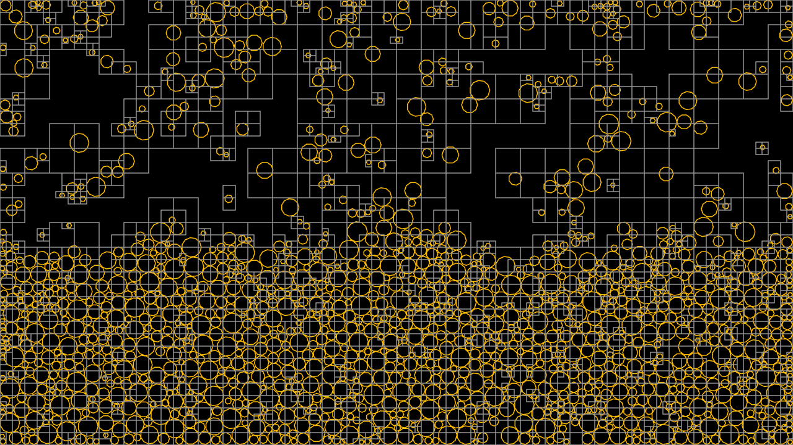

# broadphase-rs [](https://travis-ci.org/zvxryb/broadphase-rs)



## Overview

broadphase-rs is a, creatively named, broadphase collision detection library in Rust.  It transforms object bounds
into a lightweight spatial index representation, a single integer.  A vector of such indices is sorted directly to
yield a result which is a topologically-sorted Morton order, after which full-system collision detection can be
accomplished by a single pass over the sorted list with only a minimal auxiliary stack necessary to maintain state.
Collision tests between indices are accomplished with simple bitwise shifts, masks, and XORs.

This method is capable of supporting objects of varying scale (unlike uniform grids), while having a straightforward,
non-hierarchical structure in memory (unlike quad- or oct-trees), as the entire representation exists in a single
vector of index/object pairs.

## Usage

From the included example:

```Rust
struct Collisions {
    system: broadphase::Layer<broadphase::Index64_3D, specs::world::Index>,
    collisions: Vec<(specs::Entity, specs::Entity, f32, Vector2<f32>)>,
}

// ...

self.system.clear();
self.system.extend(collision_config.bounds,
    (&entities, &positions, &radii).join()
        .map(|(ent, &pos, &Radius(r))| {
            let bounds = Bounds{
                min: Point3::new(pos.1.x - r, pos.1.y - r, 0.0f32),
                max: Point3::new(pos.1.x + r, pos.1.y + r, 0.0f32)};
            (bounds, ent.id())}));

self.collisions = self.system.detect_collisions()
    .iter()
    .filter_map(|&(id0, id1)| {
        // ...narrow-phase...
    })
    .collect();
```